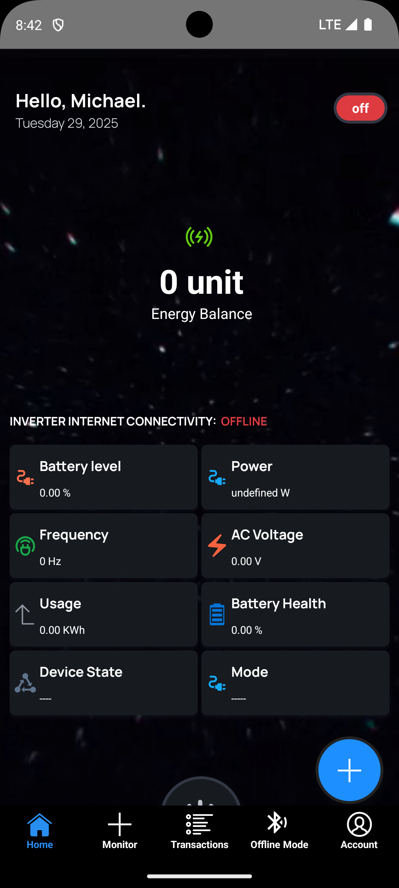

# Technovate PowerBox Mobile Application

<div align="center">
  
  [](https://reactnative.dev/)
  [](https://firebase.google.com/)
  [](LICENSE)
  [](https://reactnative.dev/)
</div>


<div align="center">
  
</div>


## About PowerBox

**PowerBox** is a revolutionary portable, solar-powered device with an inbuilt battery that provides reliable electricity to the 85+ million Nigerians living in areas with unstable power or no grid access. 

Our innovative **Pay-As-You-Use (PAYU)** model allows users to pay for energy as they consume it, making clean energy affordable and accessible while eliminating the high upfront costs of traditional solar systems.


Apk download link [PowerBox mobile application mvp](https://drive.google.com/file/d/1-Q-QwQMR833r_qsoZ4KnMfFXK8ZsQnST/view?usp=sharing)

## Mobile Application Features

- **Device Control**: Monitor and control your PowerBox device remotely
- **Real-time Monitoring**: Track energy consumption, battery levels, and solar generation
- **Flexible Payments**: Pay-as-you-use model with Interswitch payment gateway integration
- **Usage Analytics**: Detailed insights into your energy consumption patterns
- **Offline Support**: Bluetooth connectivity for local device communication
- **IoT Integration**: MQTT protocol for seamless device-to-cloud communication
- **User Management**: Account creation, profile management, and usage history

## Tech Stack

### Frontend
- **React Native** - Cross-platform mobile development
- **TypeScript** - Type-safe development
- **React Navigation** - Navigation library
- **React Native Bluetooth** - Local device communication

### Backend & Services
- **Firebase Firestore** - NoSQL database for user data and transactions
- **Firebase Authentication** - Secure user authentication
- **Firebase Cloud Functions** - Serverless backend logic

### Communication Protocols
- **Bluetooth Low Energy (BLE)** - Offline device communication
- **MQTT** - IoT messaging protocol for real-time device updates
- **REST APIs** - Backend service integration

### Payment Integration
- **Interswitch Payment Gateway** - Secure payment processing
- **Pay-As-You-Use (PAYU)** - Flexible payment model

## Getting Started

### Prerequisites

- Node.js (v16 or higher)
- React Native CLI
- Android Studio (for Android development)
- Xcode (for iOS development)
- CocoaPods (for iOS dependencies)

### Installation

1. **Clone the repository**
   ```bash
   git clone https://github.com/cmcWebCode40/Technovate-PowerBox-mobile-application
   cd Technovate-PowerBox-mobile-application
   ```

2. **Install dependencies**
   ```bash
   npm install
   ```

3. **Android Setup**
   ```bash
   npm run clean:android:gradlew
   ```


### Running the Application

#### Development Mode

```bash
# Start Metro bundler
npm start

# Run on Android
npm run android

# Run on iOS (macOS only)
npx react-native run-ios
```

#### Production Builds

```bash
# Android Production Build
npm run android:prod:build

# Android Staging Build
npm run android:staging:build
```

### Development Scripts

```bash
# Linting
npm run lint

# Clean Android build
npm run clean:android:gradlew

# Clean iOS pods
npm run clean:ios:pods
```

##  Configuration

### Firebase Setup
1. Create a Firebase project
2. Enable Firestore Database
3. Configure Authentication
4. Download `google-services.json` (Android) and `GoogleService-Info.plist` (iOS)
5. Place configuration files in respective platform directories

### Bluetooth Permissions
Ensure proper permissions are set in:
- `android/app/src/main/AndroidManifest.xml` (Android)
- `ios/PowerBoxApp/Info.plist` (iOS)


## Payment Integration

The app integrates with Interswitch Payment Gateway for secure transactions:

- Credit/Debit card payments
- Bank transfers
- Mobile money integration
- Real-time payment verification
- Transaction history and receipts

### MQTT (Online Mode)
- Cloud-based device monitoring
- Remote control capabilities
- Data synchronization
- Push notifications


## Contributing

We welcome contributions! Please follow these steps:

1. Fork the repository
2. Create a feature branch (`git checkout -b feature/amazing-feature`)
3. Commit your changes (`git commit -m 'Add amazing feature'`)
4. Push to the branch (`git push origin feature/amazing-feature`)
5. Open a Pull Request


## 📄 License

This project is licensed under the MIT License - see the [LICENSE](LICENSE) file for details.


<div align="center">
  <p>Made with ❤️ by Technovate Team</p>
  <p>Empowering Nigeria with clean, affordable energy</p>
</div>